<p align="center">
  
</p>

<h1 align="center">FinanCerto</h1>

<p align="center">
  <a href="https://github.com/financerto/financerto-app/actions/workflows/ci.yml"></a>
  <a href="https://github.com/financerto/financerto-app/actions/workflows/codeql.yml"></a>
  <a href="LICENSE"></a>
  <br>
  
  
  
  
  <br>
  <a href="#funções">Funções</a> ·
  <a href="#instalação">Instalação</a> ·
  <a href="#screenshots">Screenshots</a> ·
  <a href="#instalar-no-celular">App no celular</a> ·
  <a href="#open-finance-puxar-o-extrato-do-banco-automaticamente">Open Finance</a> ·
  <a href="CONTRIBUTING.md">Contribuir</a> ·
  <a href="SECURITY.md">Segurança</a>
</p>

<p align="center">
  <b>Português</b> · <a href="README.en.md">English</a>
</p>

<h3 align="center">App de finanças quer os seus dados. Este não quer.</h3>

<p align="center">
Controle financeiro mensal — renda, despesas, cartões e investimentos — feito
para rodar no <i>seu</i> servidor. Nenhuma empresa entre você e o seu dinheiro:
o banco é um arquivo SQLite dentro da pasta <code>data/</code>, na sua máquina,
e nada sai dali. Sem mensalidade, sem conta em nuvem, sem telemetria.
</p>

## Instalação

**Linux e macOS** — um comando (instala o Docker se ainda não houver):

```bash
curl -fsSL https://raw.githubusercontent.com/financerto/financerto-app/main/install.sh | bash
```

O script clona o repositório, sorteia a senha do administrador e a chave de
sessão, sobe o container e imprime o endereço e a senha no fim.

**Windows** — instale o [Docker Desktop](https://www.docker.com/products/docker-desktop/) e depois:

```bash
git clone https://github.com/financerto/financerto-app.git
cd financerto-app
copy .env.example .env
docker compose pull
docker compose up -d
```

Abra `http://localhost:8420` e entre com o usuário `admin`. Pronto.

> **A imagem vem pronta.** Os dois caminhos acima baixam
> `ghcr.io/financerto/financerto-app:latest`, publicada para **amd64 e
> arm64** — então num Raspberry Pi a instalação são segundos, e não os vários
> minutos de compilar as dependências no próprio aparelho. A etiqueta
> `latest` acompanha o `main`, que é exatamente o que a instalação entregava
> antes clonando e construindo. Quem prefere fixar uma versão usa a etiqueta
> da release — `:3.4`, ou `:v3.4` se preferir a tag como aparece na página. E
> para prender a um ponto exato do histórico existe `:main-<commit>`, por
> exemplo `:main-ea4cd28`, que nunca muda depois de criada. Para construir
> localmente mesmo assim — é o que fazem quem desenvolve e quem mudou o
> código — use `docker compose up -d --build`.

> Para instalar numa porta diferente: `PORTA=8421 curl -fsSL ... | bash`.
> O passo a passo manual, com todas as variáveis, está em
> [Instalação manual](#instalação-manual).

## Funções

- **Dashboard** — saldo do mês, dinheiro disponível, receitas e despesas,
  gráfico de fluxo de caixa (resumo do mês e evolução dia a dia), gráfico de
  tendência dos últimos 6 meses, contas vencendo nos próximos 7 dias,
  parcelas futuras e resumo por conta. Os cartões do dashboard são
  clicáveis e mostram como cada valor foi calculado.
- **Receitas & Despesas** — lançamentos avulsos ou recorrentes (aluguel,
  salário), com parcelamento automático (informe o valor total ou o valor
  da parcela) e anexo de comprovante/foto por lançamento. Botão para copiar
  os lançamentos recorrentes do mês anterior sem digitar tudo de novo.
- **Escanear nota fiscal** — no botão flutuante, tira foto do cupom fiscal
  pela câmera do celular e o app lê a loja, o valor e os itens comprados
  automaticamente (OCR), sempre com uma tela de revisão antes de lançar a
  despesa. Tem também um botão só de "Importar comprovante", que já abre o
  formulário de despesa com o arquivo anexado.
- **Investimentos** — carteira completa: ações, FIIs, ETFs, BDRs,
  criptomoedas, ativos americanos (stocks, REITs e ETFs), renda fixa
  (CDB/LCI/LCA/debênture/Tesouro, com emissor e liquidez) e fundos. Você
  busca o ativo pelo ticker, o preço atual já vem preenchido, e a **cotação
  se atualiza sozinha** de hora em hora. Os **proventos são importados
  automaticamente**: o app sabe quantas cotas você tinha na data-base de cada
  dividendo, JCP ou rendimento e lança o valor certo na conta, já descontando
  o imposto do JCP. Em cinco abas — Resumo, Posições, Proventos, Patrimônio e
  Rentabilidade — dá pra ver o patrimônio crescendo mês a mês desde a
  primeira compra, quanto rendeu contra o CDI, tudo que já caiu de provento e
  o que ainda vai cair. Definindo a distribuição ideal da sua carteira (ex:
  40% em ações, 25% em FIIs), cada ativo ganha uma coluna **Comprar?**
  dizendo se está abaixo ou acima da meta.
- **Orçamento por categoria** — defina um limite mensal para cada categoria
  de despesa e acompanhe numa barra de progresso o quanto já foi gasto.
- **Metas de economia** — crie metas com valor alvo e prazo opcional, e vá
  registrando quanto já conseguiu guardar.
- **Holerite** — importe o PDF do contracheque e o app lê sozinho os
  proventos, descontos, o líquido recebido no fim do mês e o adiantamento
  quinzenal, lançando as receitas correspondentes automaticamente. Mostra
  um gráfico de renda/descontos por mês — clique numa barra de proventos ou
  descontos pra ver exatamente quais itens do contracheque compuseram
  aquele valor. Avisa quando falta importar o holerite de algum mês
  (inclusive já deixa um espaço pronto pro próximo mês) e permite
  conferir/editar os lançamentos gerados por cada holerite.
- **Empréstimos** _(opcional)_ — acompanhamento de empréstimos (consignados
  em folha ou com débito em conta), com parcela atual/total e progresso.
  Fica oculto por padrão; só o administrador (primeiro usuário da
  instalação) pode habilitar essa aba para todo mundo, na aba Backup.
- **Contas** — várias contas por usuário, com saldo calculado
  automaticamente, e transferências entre contas (inclusive entre contas de
  usuários diferentes, ex: da sua conta para a da sua esposa/marido) sem
  contar como receita/despesa real.
- **Cartões de crédito** — limite, fatura atual, dia de vencimento, conta
  vinculada para débito automático da fatura, e aviso quando a fatura está
  perto (ou passou) do limite.
- **Categorias** — categorias próprias de receita/despesa, com cor.
- **Calendário** — visão mensal dos vencimentos, com indicação de pago,
  pendente e recebido.
- **Múltiplos usuários por casa** — cada pessoa da sua casa (família) tem o
  próprio login; dá pra ver e mover dinheiro entre as contas de todo mundo
  dentro da mesma casa. Cada usuário pode ser marcado como **somente
  leitura** (vê tudo, não edita nada).
- **Cadastro público (`/registro`)** — qualquer pessoa pode criar a própria
  casa, totalmente isolada da sua — sem ver nem uma categoria, conta ou
  lançamento seus, e vice-versa. Quem cria uma casa nova já entra como
  administrador dela. Backup completo do banco fica desativado
  automaticamente se o servidor tiver mais de uma casa (evita vazar dado de
  uma casa pra outra).
- **Backup** — baixe um `.zip` com lançamentos, comprovantes, holerites e
  fotos a qualquer momento, guarde backups agendados no servidor, ou
  restaure a partir de um arquivo. É também onde fica o botão de exportar
  os lançamentos do mês selecionado em CSV.
- **Modo demonstração** — ativa um banco de dados fictício separado pra
  mostrar o app pra alguém sem expor seus dados reais.
- **Instalável como app (PWA)** — abre em tela cheia no celular, como um
  app nativo.
- **Tema claro/escuro** e opção de **ocultar valores** na tela (útil pra
  usar em público).

## Screenshots

_Capturas feitas com o **modo demonstração** ligado — dados fictícios._

| | |
|---|---|
| **Entrar** | 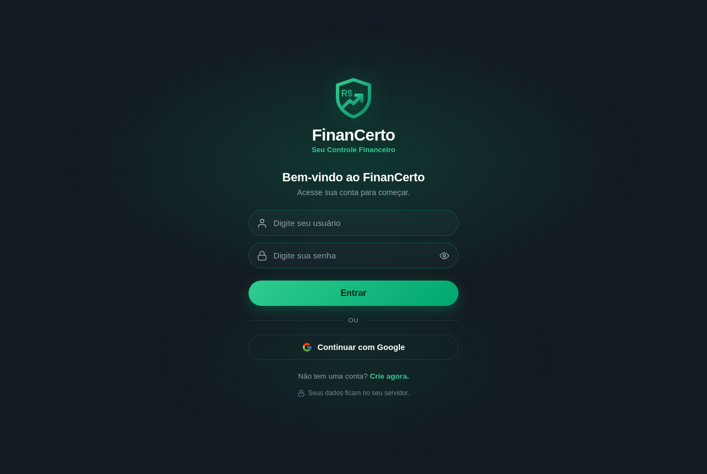 |
| **Criar casa** | 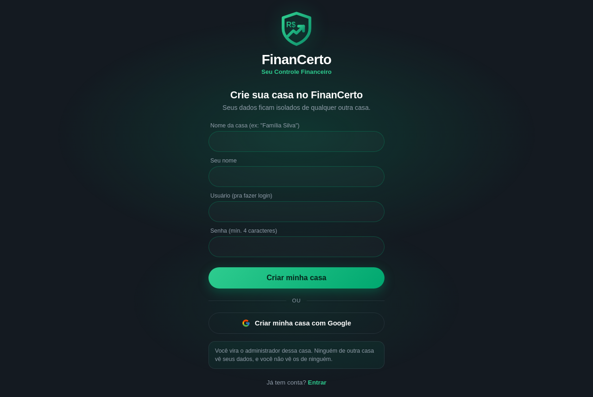 |
| **Dashboard** | 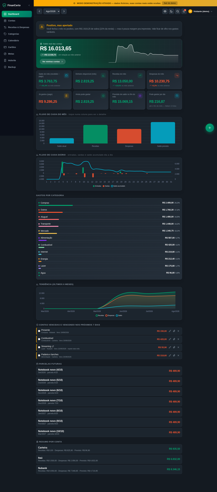 |
| **Receitas & Despesas** | 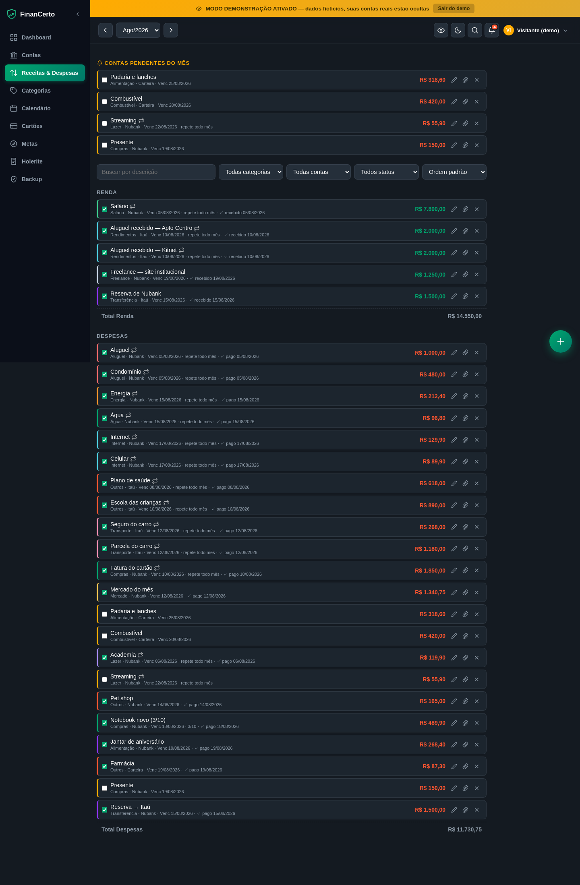 |
| **Investimentos** | 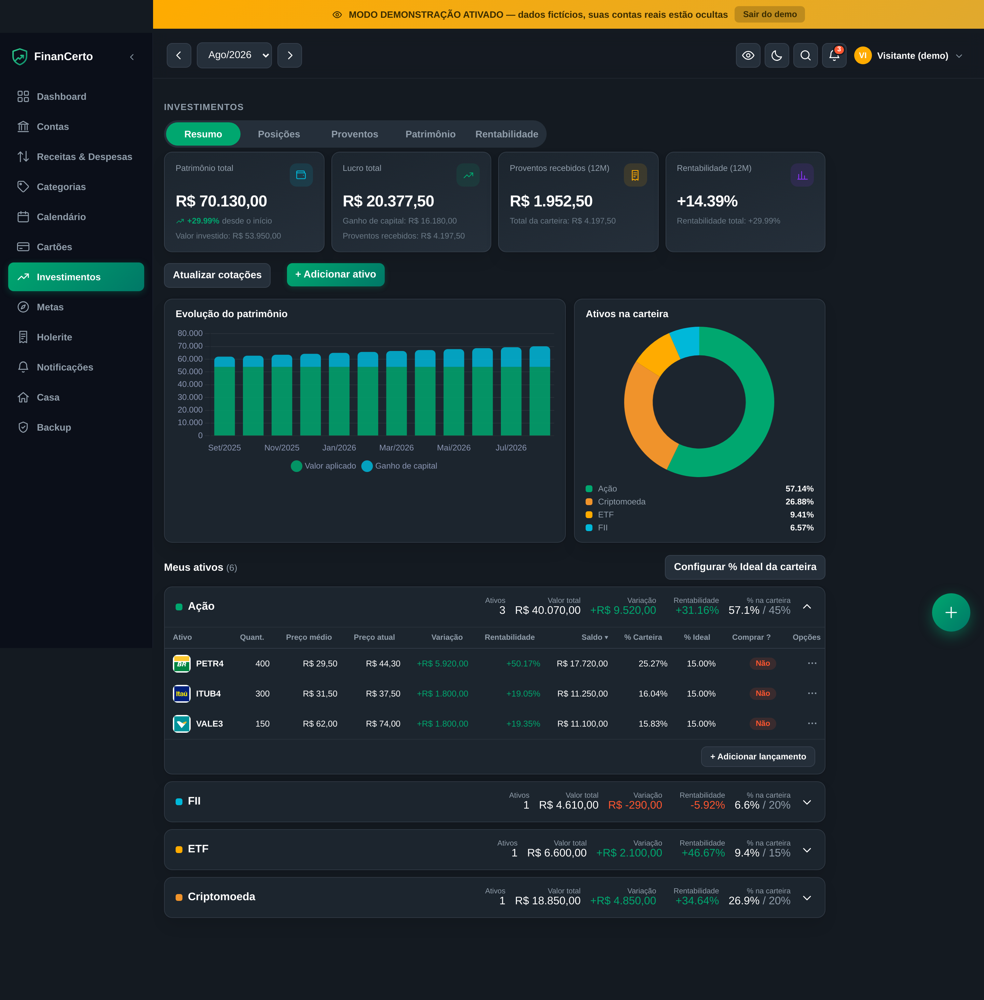 |
| **Proventos recebidos e a receber** | 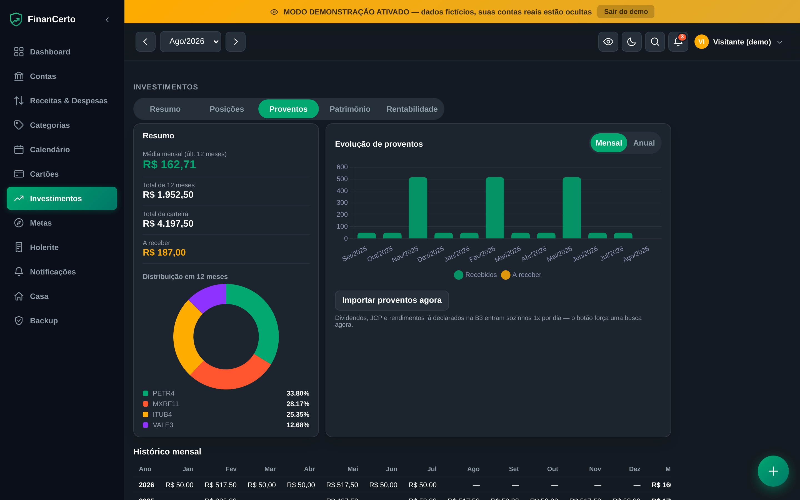 |
| **Rentabilidade contra o CDI** | 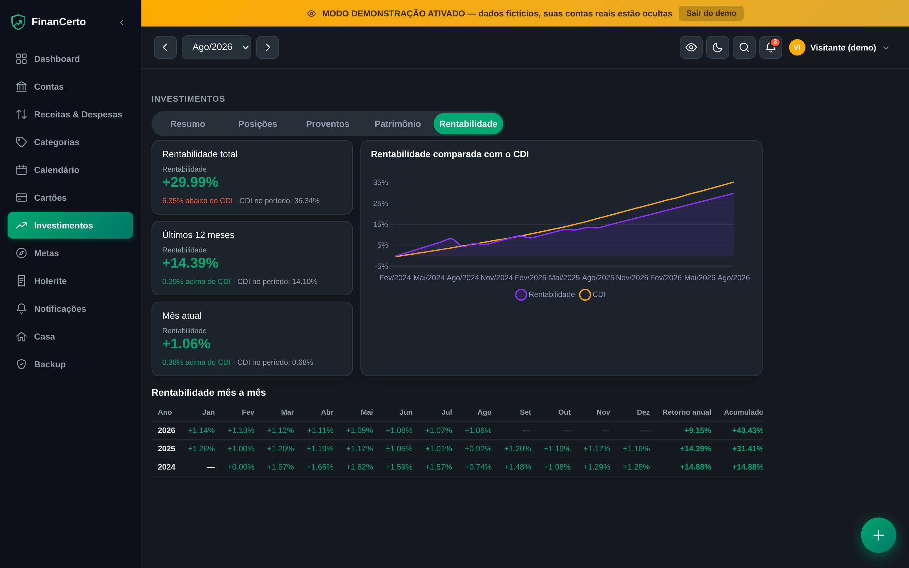 |
| **Calendário** | 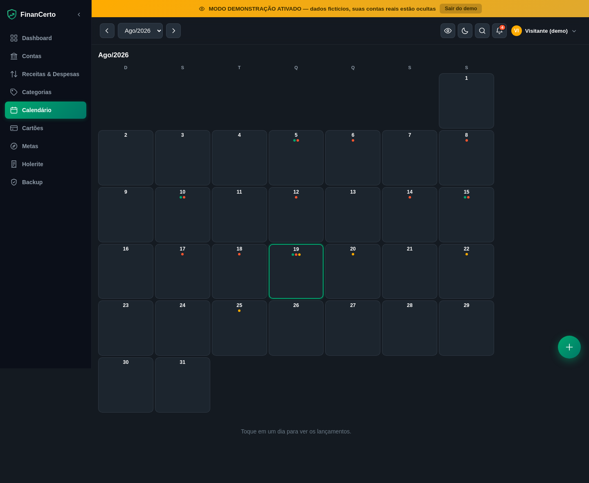 |
| **Cartões de crédito** | 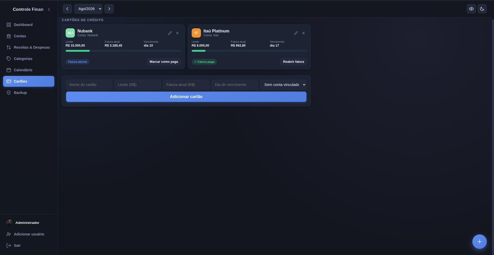 |
| **Backup automático** | 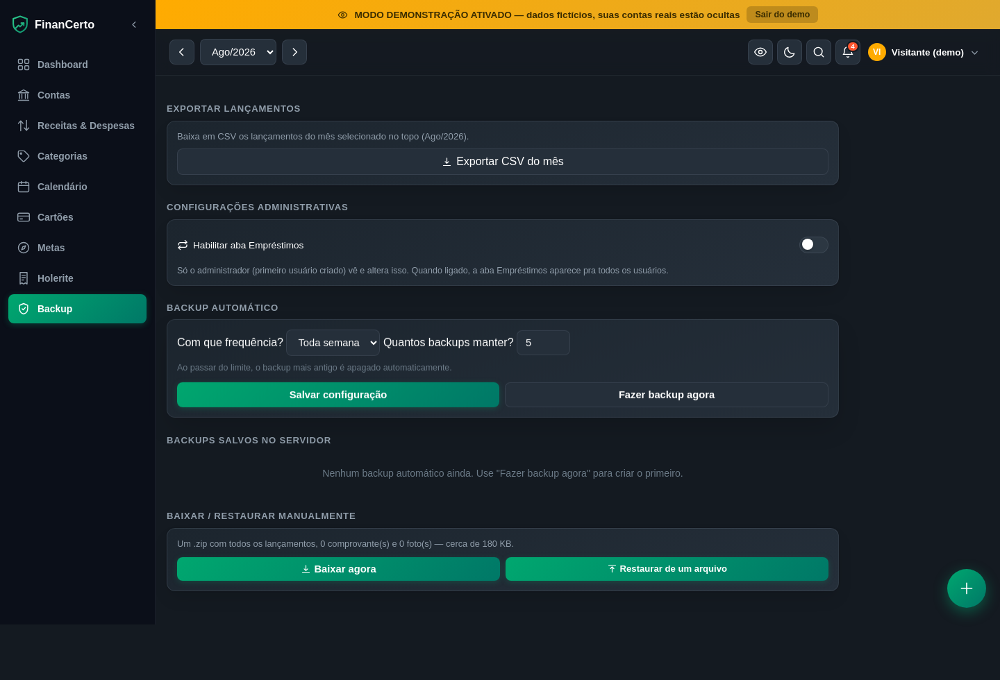 |

No celular, quem abre pelo Android recebe o convite para baixar o app; no
iPhone, o passo a passo para instalar na tela de início.

<p align="center">
  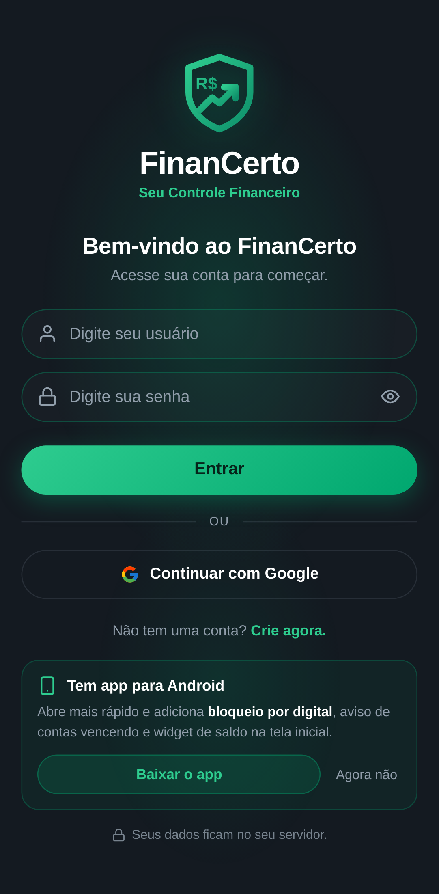
</p>

## Instalação manual

Se você prefere não rodar o script de instalação, ou quer ver o que ele faz:

1. Acesse via SSH (ou o terminal instalado).
2. Clone o repositório e suba o container:
   ```bash
   git clone https://github.com/financerto/financerto-app.git
   cd financerto-app
   docker compose up -d --build
   ```
3. Acesse no navegador: `http://localhost:8420` (IP da sua máquina).

A pasta `data/` é criada sozinha no primeiro start e guarda o banco, os
comprovantes e as fotos. Ela fica fora do container, então atualizar o código
não apaga nada.

## Login

O app exige login. No primeiro start:

- Se você definiu `ADMIN_USERNAME`/`ADMIN_PASSWORD` no `docker-compose.yml`, use essas credenciais.
- Se não definiu, uma senha aleatória é gerada automaticamente. Para ver qual foi,
  rode `docker compose logs` logo após o primeiro `docker compose up -d --build` e
  procure o bloco `USUÁRIO INICIAL CRIADO`.
- Depois de entrar, troque a senha clicando no seu nome no rodapé do menu lateral.
- Para adicionar outro usuário **da sua casa** (ex: esposa/marido), clique em
  "Adicionar usuário" no rodapé do menu lateral.
- Pra dar acesso a alguém de **fora da sua casa** (um amigo, outra família),
  mande o link `/registro` — a pessoa cria a própria casa, separada da sua.

### Login com Google (opcional)

Além de usuário/senha, dá pra habilitar um botão "Entrar com Google" — quem
usa pela primeira vez também cria a própria casa automaticamente, do mesmo
jeito que pelo `/registro`. Pra ativar:

1. Crie um "ID do cliente OAuth" (tipo **Aplicativo da Web**) em
   [console.cloud.google.com](https://console.cloud.google.com) → APIs e
   Serviços → Credenciais.
2. Em "URIs de redirecionamento autorizados", cadastre
   `https://SEU-DOMINIO/api/auth/google/callback`.
3. Copie `GOOGLE_CLIENT_ID` e `GOOGLE_CLIENT_SECRET` pro seu `.env`.
4. Enquanto a tela de consentimento OAuth do seu app estiver em modo
   **"Teste"**, só os e-mails que você cadastrar manualmente lá conseguem
   entrar. Pra qualquer pessoa poder usar, publique o app (status
   "Em produção") na tela de consentimento.

Sem essas variáveis definidas, o botão simplesmente não aparece — o login
por usuário/senha continua funcionando normalmente.

## Instalar no celular

### App Android (recomendado)

Baixe o APK na [página de releases](../../releases/latest) e instale. Como não
vem da Play Store, o Android pede para autorizar a instalação de "fontes
desconhecidas" na primeira vez.

Na primeira abertura o app pergunta o endereço do **seu** servidor — não vem
apontado para lugar nenhum. Vale tanto um domínio quanto o endereço na sua rede:

```
financeiro.seudominio.com.br
192.168.1.10:8420
```

Ele testa a conexão antes de salvar, então erro de digitação aparece na hora em
vez de virar tela branca. Para trocar depois, use "Trocar servidor" na tela de
erro de conexão.

O que o app faz além de abrir o site:

- **Bloqueio por digital ou PIN** ao abrir, usando o desbloqueio do próprio
  aparelho. Se o celular não tiver nenhum bloqueio configurado, abre direto —
  não faz sentido proteger o app se a tela do celular está aberta.
- **Aviso de contas vencendo**, checado em segundo plano.
- **Widget de saldo** para a tela inicial.
- Envio de arquivos (comprovantes e notas) direto da galeria ou da câmera.

### Ou como PWA

Sem instalar nada: acesse pelo Chrome e use "Adicionar à tela inicial". Abre em
tela cheia, mas sem digital, widget nem notificações.

## Open Finance: puxar o extrato do banco automaticamente

O FinanCerto se conecta aos seus bancos pela [Pluggy](https://pluggy.ai), que é
uma instituição de pagamento autorizada pelo Banco Central. Feita a conexão, o
extrato vira lançamento sozinho e o saldo do app passa a bater com o do banco.

**É opcional.** Sem configurar nada, o app funciona normalmente com lançamento
manual — e continua sendo o modo mais privado, porque nenhum dado sai do seu
servidor.

### O que isso custa

O plano comercial da Pluggy custa a partir de R$ 2.500/mês e não serve para uso
pessoal. O caminho aqui é o **Meu Pluggy**, gratuito por tempo indeterminado
para você acessar **os seus próprios dados**, nas contas do seu nome.

O Dashboard abre com um teste de 15 dias, mas isso vale só para recursos
comerciais: **depois dos 15 dias você continua puxando os seus dados de graça**,
pelo conector MeuPluggy.

### Antes de começar, entenda o que você está autorizando

- A senha do seu banco **nunca passa pelo FinanCerto nem pela Pluggy**: você faz
  login na página do próprio banco, pelo Open Finance.
- O consentimento é **somente leitura** — extrato e saldo. Movimentar dinheiro é
  outro consentimento, que você teria que autorizar separadamente.
- Dura no máximo **12 meses** e você **revoga quando quiser**, pelo app do seu
  banco, com efeito imediato.
- Em troca, o seu histórico de transações passa a existir também nos servidores
  da Pluggy. É uma troca real: pese antes de decidir.

### Passo a passo

**1. Conecte seus bancos no Meu Pluggy**

Crie a conta em [meu.pluggy.ai](https://meu.pluggy.ai) e conecte cada banco.
Confira que o fluxo te leva para a **página do próprio banco** para o login —
é o sinal de que você está no conector regulado do Open Finance.

**2. Pegue suas credenciais de desenvolvedor**

Crie a conta em [dashboard.pluggy.ai](https://dashboard.pluggy.ai). Em
**Dados Financeiros → Customização → Conectores**, procure por "MeuPluggy" e
deixe o conector **(200) MeuPluggy** ligado. Salve.

Em **Aplicações**, crie uma aplicação e copie o **Client ID** e o **Client
Secret** — o secret costuma aparecer uma vez só.

> Não faça a etapa de *due diligence*, que pede dados de empresa: é o caminho
> comercial pago e não serve para uso pessoal.

**3. Ligue a sua conta do Meu Pluggy à aplicação**

Ainda no Dashboard, abra o widget e escolha o conector **MeuPluggy**. Ele
redireciona para o `meu.pluggy.ai` e você autoriza — **não pede senha nenhuma**,
é OAuth.

Repita **uma vez por banco** conectado. Cada banco vira uma conexão com um
**Item ID** próprio (um UUID). Copie os Item IDs; a Pluggy não tem endpoint que
liste isso, então é você quem guarda.

**4. Configure no FinanCerto**

Na aba **Contas**, seção **Open Finance**, cole o Client ID e o Client Secret.
Depois cole cada **Item ID** no campo "Conectar banco".

**5. Vincule cada conta**

Para cada conta que aparecer, escolha no seletor se ela é uma **conta** do
FinanCerto, um **cartão**, ou se deve ser **ignorada**. Enquanto não houver
vínculo, nada é importado — isso é proposital.

### O que acontece depois

- Uma sincronização diária traz o que chegou e mantém o saldo igual ao do banco.
- Todo lançamento vindo do banco leva o selo **Open Finance**, para você
  distinguir do que digitou.
- Transação que já existe como lançamento seu é **reconhecida, não duplicada**
  (mesmo valor, data com três dias de folga).
- Numa conta sincronizada o **saldo inicial deixa de ser editável**: ele passa a
  ser calculado a partir do extrato, e mexer nele faria o saldo parar de bater.

### Avisos na hora (webhook, opcional)

Sem isso, a novidade aparece em até 24 horas. Com o webhook, a Pluggy avisa
assim que chega transação nova ou a conexão quebra.

Exige que o seu servidor tenha **endereço público HTTPS** (a Pluggy recusa
`localhost`). Defina no `.env`:

```
PLUGGY_WEBHOOK_URL=https://seu-dominio.com.br
```

Reinicie e, na aba Contas, use **Ativar avisos na hora**. O endpoint se protege
com um segredo gerado sozinho em `data/.pluggy_webhook` — ele vai embutido na
URL registrada na Pluggy e não precisa ser digitado em lugar nenhum.

### Se algo der errado

| Sintoma | O que costuma ser |
|---|---|
| "a Pluggy recusou as credenciais" | Client ID/Secret trocados, ou o conector MeuPluggy não foi habilitado em Customização |
| "a Pluggy não encontrou esse Item ID" | O Item é de outra aplicação, ou o passo 3 não foi feito para aquele banco |
| Conectou mas não aparece conta | Falta vincular a conta ao seu equivalente no FinanCerto |
| A data de sincronização não anda | O consentimento pode ter expirado — reconecte pelo `meu.pluggy.ai` |

Seus dados importados ficam no **seu** banco SQLite. Se um dia você desligar o
Open Finance, nada do que já entrou se perde.

## Estrutura

- `app.py` — backend Flask (API REST + serve o site + autenticação)
- `static/index.html` — frontend do app (uma página só)
- `static/login.html` — tela de login
- `static/registro.html` — tela de cadastro público (cria uma casa nova)
- `static/manifest.json`, `static/sw.js`, `static/icon*.svg` — arquivos do PWA
- `static/chart.umd.min.js` — Chart.js 4.4.1 (MIT), servido pelo próprio app:
  os gráficos funcionam sem internet e nenhum CDN fica sabendo quem abriu a tela
- `Dockerfile` / `docker-compose.yml` — empacotamento (inclui `tesseract-ocr`
  para a leitura de nota fiscal)
- `.env.example` — modelo das variáveis de ambiente aceitas; copie para
  `.env` e preencha (o `.env` de verdade nunca é versionado)
- `migrations/` — mudanças de schema do banco, aplicadas em ordem e
  registradas numa tabela de controle (`schema_migrations`) toda vez que o
  app sobe
- `data/` — onde o banco SQLite, a chave de sessão, os comprovantes, os
  holerites e as fotos ficam salvos (fica fora do container, não perde
  dados ao atualizar)
- `android/` — código do app Android (WebView com digital, notificação de
  contas e widget de saldo). Para compilar o seu:
  `docker build -t android-build-env -f android/Dockerfile.build android/` e
  depois `gradle assembleRelease` dentro dele. O APK sai sem assinatura;
  assine com a sua própria chave.
- `install.sh` — instalador de um comando (confere o Docker, clona, gera o
  `.env` com senha sorteada e sobe o container)
- `testes/teste_anexos.py` — confere a leitura do holerite em PDF e do cupom
  fiscal por OCR, com arquivos montados na hora; roda de dentro do container
- `testes/teste_seguranca.py` — tenta fazer o ticker virar outro endereço e o
  nome de anexo virar outro caminho, e confere que as duas coisas são recusadas
- `.github/workflows/` — CI (ruff, migrations, build da imagem e o teste dos
  anexos) e CodeQL

## Trocar a porta

Se `8420` já estiver em uso, edite `docker-compose.yml` e troque
`"8420:5000"` para outra porta livre, ex: `"8421:5000"`.

## Contribuir

Issue, correção e ideia são bem-vindas — inclusive "instalei e não entendi essa
tela". O guia está em [CONTRIBUTING.md](CONTRIBUTING.md), e vale o
[Código de Conduta](CODE_OF_CONDUCT.md) em todos os espaços do projeto.

Encontrou uma falha de segurança? **Não abra issue pública** — use o
[canal privado](https://github.com/financerto/financerto-app/security/advisories/new).
Os detalhes estão em [SECURITY.md](SECURITY.md).

## Feito com ajuda de IA

Parte deste código foi escrita com ajuda de IA, e toda linha passou por revisão
humana antes de entrar. Nenhum dado seu sai do seu servidor por causa disso —
não há chamada a serviço de IA em tempo de execução. Contribuição feita com IA
também é bem-vinda: veja [Uso de IA](CONTRIBUTING.md#uso-de-ia).

## Licença

FinanCerto é software livre, sob a **GNU Affero General Public License, versão 3
(AGPL-3.0)**. O texto completo está em [`LICENSE`](LICENSE).

Na prática, o que isso garante:

- **Use à vontade.** Rodar no seu servidor, para você ou para a sua família, sem
  pedir permissão a ninguém e sem pagar nada.
- **Modifique à vontade.** O código é seu para adaptar.
- **Se você distribuir uma versão modificada, publique o código dela.** Vale
  também para quem *hospeda* uma versão modificada e deixa outras pessoas
  usarem pela rede — é essa a diferença da AGPL para a GPL comum. Ninguém pode
  pegar o FinanCerto, fechar o código e revender como serviço.

A escolha da AGPL é coerente com o motivo de o app existir: os seus dados
financeiros ficam no seu servidor, e o código que mexe neles fica aberto para
qualquer um auditar.
